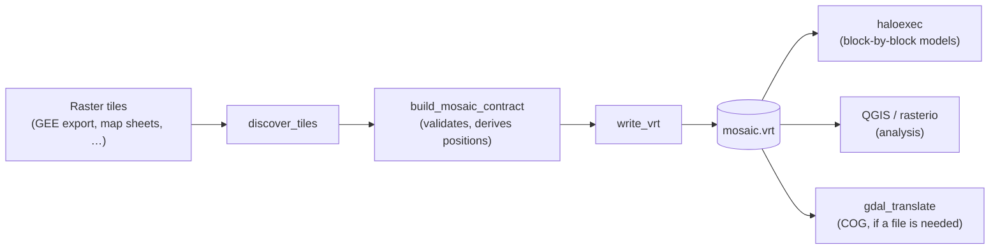

# geomosaic

**geomosaic** assembles a set of raster tiles into a single, validated
logical grid, written as a GDAL Virtual Raster (`.vrt`). The VRT copies
no pixels: it is a small XML file that references the original tiles,
and any GDAL-based reader (`rasterio`, QGIS, `gdal_translate`) opens it
like one ordinary GeoTIFF — including windows that cross tile
boundaries.

It needs only [rasterio](https://rasterio.readthedocs.io), not the GDAL
Python bindings (`osgeo`), so it installs with plain `pip`.

!!! note "Status: alpha"
    The API is small and tested, but may still change before 1.0.

## Where it fits

Large rasters rarely arrive as one file: Google Earth Engine exports
are split into tiles (often with several products or years in one
folder), national datasets are distributed as map sheets, and
processing pipelines write their output tile by tile. geomosaic is the
step that puts those tiles back together — and checks that they really
fit — before anything else reads them.



geomosaic knows nothing about execution engines, blocks or halos, so it
fits in front of any raster workflow. In the
[DisSModel](https://github.com/DisSModel) ecosystem it is the
data-preparation step for spatial models:
[`haloexec`](https://github.com/DisSModel/haloexec) reads the VRT block
by block with no special integration.

## Installation

```bash
pip install "geomosaic @ git+https://github.com/LambdaGeo/geomosaic.git"
```

For development:

```bash
git clone https://github.com/LambdaGeo/geomosaic.git
cd geomosaic
pip install -e ".[dev]"
pytest
```

## Quick start

```python
from geomosaic import discover_tiles, build_mosaic_contract, write_vrt

tiles = discover_tiles("data/export/", pattern="landcover_2020*")
contract = build_mosaic_contract(tiles)   # validates the tile set, derives positions
vrt_path = write_vrt(contract, "data/landcover_2020.vrt")

import rasterio
with rasterio.open(vrt_path) as ds:       # opens like a single GeoTIFF
    print(ds.width, ds.height, ds.crs)
```

`examples/tiled_export.py` runs the whole flow on a synthetic tiled
export (two products in one folder, an empty grid cell, a partial tile
at the edge):

```bash
python examples/tiled_export.py
```

## Where to go next

- [Concepts](concepts.md) — how tile positions are derived and what the
  VRT contains.
- [Validation checks](validation.md) — every check
  `build_mosaic_contract` makes, what it catches and how to fix it.
- [Recipes](recipes.md) — GEE exports, multi-band mosaics, portable
  VRTs, feeding `haloexec`, materializing a GeoTIFF.
- [API reference](api.md) — generated from the docstrings.
